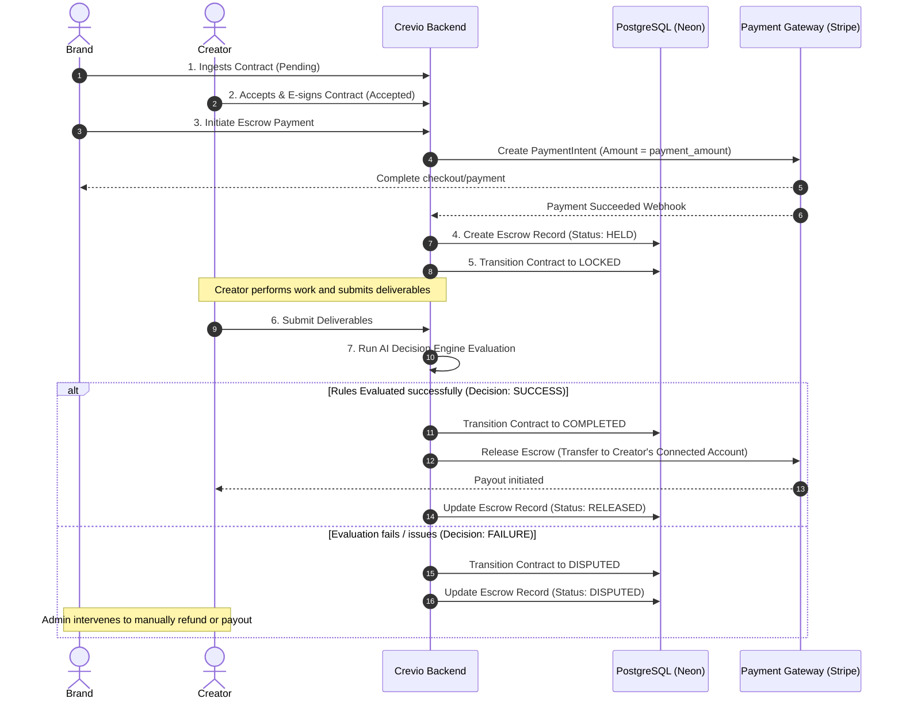

# Campaign Escrow & Deposit Payment System Plan

This document outlines the end-to-end plan to integrate an Escrow (Deposit) Payment System into **Crevio (ACEMS)**. 

An escrow system acts as a trusted third-party holding chamber that secures campaign funds from the Brand after contract acceptance and automatically releases them to the Creator upon successful verification of deliverables by the AI Decision Engine (or manual dispute resolution by Admins).

---

## Technical Overview & Lifecycle Integration

To preserve the automated nature of Crevio, the escrow system integrates directly into the contract lifecycle:



---

## User Review Required

> [!IMPORTANT]
> **Key Design Decisions for the User:**
> 
> 1. **Payment Infrastructure Choice:** 
>    We recommend **Stripe Connect (Custom/Express)** as it natively handles escrow/marketplace split payments, handles KYC/onboarding for creators automatically, and holds funds securely in Stripe's platform account until contract completion. 
>    *Alternative:* Razorpay Route or simulated virtual wallets (ledger-based balances) for a self-hosted mock solution before deploying to production.
>
> 2. **Escrow Funding Timing:**
>    Should funding happen immediately upon contract creation (to prevent creator drop-off), or only after the creator has accepted and signed? 
>    *We recommend funding once the creator e-signs (transitions to `accepted` state), which then triggers the lock sequence.*

---

## Proposed Changes

We propose database schema enhancements, backend routes, and gorgeous frontend interfaces to represent wallets, deposits, and transaction ledger histories.

<hr />

### 1. Database Schema Enhancements

To represent balances, secure escrow holdings, and ledgers, we introduce three new tables:

```sql
-- database/migrations/006_escrow_and_wallets.sql

-- 1. Tracks virtual/ledger balances for platform accounts (highly useful for simulated environments and balance dashboards)
CREATE TABLE IF NOT EXISTS user_wallets (
  id TEXT PRIMARY KEY,
  user_id TEXT NOT NULL REFERENCES users(id) ON DELETE CASCADE,
  available_balance NUMERIC(12, 2) NOT NULL DEFAULT 0.00 CHECK (available_balance >= 0),
  pending_escrow_balance NUMERIC(12, 2) NOT NULL DEFAULT 0.00 CHECK (pending_escrow_balance >= 0),
  stripe_connect_account_id TEXT, -- For real stripe payout linkage
  currency TEXT NOT NULL DEFAULT 'USD',
  updated_at TIMESTAMPTZ NOT NULL DEFAULT NOW(),
  UNIQUE (user_id)
);

-- 2. Secure Escrow accounts mapped directly to contracts
CREATE TABLE IF NOT EXISTS escrow_holdings (
  id TEXT PRIMARY KEY,
  contract_id TEXT NOT NULL REFERENCES contracts(id) ON DELETE CASCADE,
  campaign_id TEXT NOT NULL REFERENCES campaigns(id),
  brand_id TEXT NOT NULL REFERENCES users(id),
  creator_id TEXT NOT NULL REFERENCES users(id),
  amount NUMERIC(12, 2) NOT NULL CHECK (amount > 0),
  status TEXT NOT NULL CHECK (status IN ('awaiting_deposit', 'held', 'released', 'refunded', 'disputed')),
  payment_intent_id TEXT, -- Stripe Reference ID
  transfer_group TEXT,     -- For grouping payouts
  created_at TIMESTAMPTZ NOT NULL DEFAULT NOW(),
  released_at TIMESTAMPTZ,
  refunded_at TIMESTAMPTZ,
  updated_at TIMESTAMPTZ NOT NULL DEFAULT NOW()
);

-- 3. Double-entry transaction ledger for safety and compliance reporting
CREATE TABLE IF NOT EXISTS wallet_transactions (
  id TEXT PRIMARY KEY,
  wallet_id TEXT NOT NULL REFERENCES user_wallets(id) ON DELETE CASCADE,
  amount NUMERIC(12, 2) NOT NULL, -- positive for credit, negative for debit
  txn_type TEXT NOT NULL CHECK (txn_type IN ('deposit', 'withdrawal', 'escrow_debit', 'escrow_credit', 'escrow_refund')),
  status TEXT NOT NULL CHECK (status IN ('pending', 'completed', 'failed')),
  description TEXT NOT NULL,
  reference_escrow_id TEXT REFERENCES escrow_holdings(id) ON DELETE SET NULL,
  stripe_charge_id TEXT,
  created_at TIMESTAMPTZ NOT NULL DEFAULT NOW()
);

-- Indexes for performance
CREATE INDEX IF NOT EXISTS idx_user_wallets_user ON user_wallets(user_id);
CREATE INDEX IF NOT EXISTS idx_escrow_holdings_contract ON escrow_holdings(contract_id);
CREATE INDEX IF NOT EXISTS idx_escrow_holdings_status ON escrow_holdings(status);
CREATE INDEX IF NOT EXISTS idx_wallet_transactions_wallet ON wallet_transactions(wallet_id);
```

<hr />

### 2. Backend API Endpoint Modifications & Additions

#### [NEW] [`server/routes/payments.mjs`](file:///c:/Users/HP/Desktop/ACEMS/server/routes/payments.mjs)
A brand-new router handling the payment processing, wallet retrieval, stripe sessions, and webhook processing:

- `GET /api/payments/wallet`: Retrieve user wallet balance, pending holdings, and transaction history.
- `POST /api/payments/deposit`: Initiates a wallet deposit (useful for brands).
- `POST /api/payments/contracts/:id/escrow-deposit`: Creates a Stripe Checkout Session or processes direct wallet deduction to fund a specific contract's escrow amount.
- `POST /api/payments/stripe-webhook`: Listen for Stripe's `payment_intent.succeeded` event to mark the contract as `locked` and set the escrow status to `held`.
- `POST /api/payments/contracts/:id/dispute-resolution`: Admin manual override endpoint to split escrow payouts in case of failures.

#### [MODIFY] [`server/routes/contracts.mjs`](file:///c:/Users/HP/Desktop/ACEMS/server/routes/contracts.mjs)
Integrate escrow hooks within the contract lifecycle hooks:
- **E-sign Stage (`/accept`):** Send a real-time socket notification to the Brand: *"Creator signed! Fund the escrow of USD $X to activate the campaign."*
- **Lock Stage (`/lock`):** Verify that the corresponding escrow holding has a status of `'held'`. Refuse to lock the contract if the funds are not securely in escrow.
- **Execution Engine Stage (`/execute`):** On `'success'`, automatically dispatch a background release order. Trigger Stripe's `transfers.create` to deposit the escrow funds directly into the Creator's connected Stripe account.

<hr />

### 3. Frontend Pages & Components

To deliver a **wow-factor, premium aesthetic** reflecting fintech security, we propose adding the following UI components:

#### A. Interactive Wallet Hub (`src/pages/WalletHub.tsx`)
A sleek dashboard for managing deposits, showing financial health, interactive earnings graphs, and ledger activity:

- **Metrics Cards:** Sleek Glassmorphism cards showing **Available Balance**, **Pending Escrow (Locked)**, and **Total Completed Payouts**.
- **Double-Entry Ledger Feed:** A modern list styled with status badges (Credit green, Debit red) showing exact transaction chains.
- **Onboarding Section (for Creators):** Stripe Connect onboarding widget indicating verification status.

#### B. Escrow Funding Widget on [`ContractDetail.tsx`](file:///c:/Users/HP/Desktop/ACEMS/src/pages/ContractDetail.tsx)
An interactive checkout card that appears for Brands:

```css
/* Styling guidelines in src/index.css for premium payment experiences */
.wallet-premium-card {
  background: linear-gradient(135deg, rgba(30, 41, 59, 0.7), rgba(15, 23, 42, 0.8));
  border: 1px solid rgba(99, 102, 241, 0.2);
  box-shadow: 0 8px 32px 0 rgba(0, 0, 0, 0.37);
  backdrop-filter: blur(12px);
}
```

- When the contract status is `accepted`, a beautiful glowing banner appears: **"🔒 Escrow Payment Required"**.
- Displays a detailed breakdown:
  - Deliverable Total: `$1,200.00`
  - Crevio Secure Escrow Fee (1.5%): `$18.00`
  - **Amount to Lock:** `$1,218.00`
- Provides a **"Deposit Funds into Escrow"** action with real-time checkout animations.

---

## Verification Plan

### Automated Tests
We will write integrated tests to verify ledger accuracy and state transition validation rules:
- `npm run test` (Vitest integration checking that contracts in `accepted` status cannot transition to `locked` without a positive matching `escrow_holdings` row of status `held`).
- Ledger math checks: Asserting that available balance + pending escrow balance matches total net transactions.

### Manual Verification
1. Log in as a **Brand**, navigate to an approved application, and create a contract terms sheet.
2. Log in as the **Creator**, sign the contract (moves state to `accepted`).
3. Log back in as **Brand**, check the contract page. Assert that the "Deposit Escrow" payment widget is active.
4. Click "Deposit", simulate successful stripe/wallet transfer. Assert that contract automatically moves to `locked` state.
5. Log in as **Creator**, verify that contract status displays: **"Escrow Secured: Awaiting work"**.
6. Simulate creator completing deliverables and brand executing: Assert that Creator's wallet receives a credit of the contract amount.
